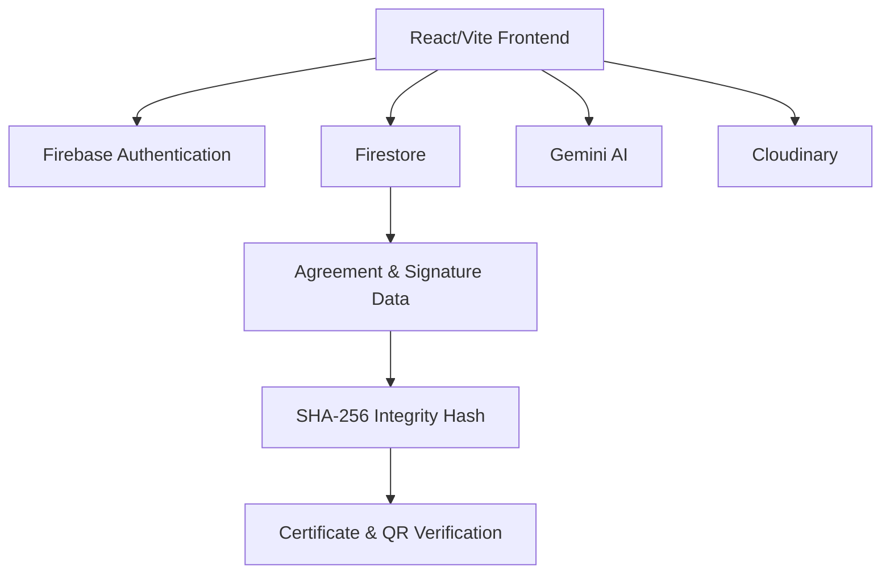

# DigiStamp

DigiStamp is an AI-powered agreement risk and verification platform for creating, reviewing, signing, and verifying digital agreements. It combines Gemini-powered agreement drafting, a concise AI Agreement Check, two-party digital signing, SHA-256 integrity hashing, certificates, and QR/public verification in a single React/Firebase workflow.

This project was prepared for the Razorpay AI Builder Internship 2026 submission under the AI Risk Manager direction.

## Problem

Agreement creation is often manual, slow, and easy to misunderstand. Important terms such as payment timing, delivery responsibilities, cancellation conditions, or dispute handling may be unclear or missing. After signing, users also need a simple way to verify that a completed agreement has not been changed.

## Solution

DigiStamp provides an AI-assisted digital agreement workflow:

1. The user enters deal details.
2. Gemini generates a draft agreement.
3. AI Agreement Check identifies important potential missing or ambiguous terms.
4. Party A reviews and signs the agreement.
5. Party B opens an invitation link, reviews, accepts or rejects, and signs.
6. A completed agreement receives a digital certificate.
7. SHA-256 integrity hashing supports tamper-evident verification.
8. QR/public verification allows the completed certificate and agreement hash to be checked later.

## Key Features

1. Firebase email/password authentication
2. AI agreement generation using Gemini
3. AI Agreement Check for concise pre-signing risk review
4. Party A digital signing
5. Party B invitation, acceptance/rejection, and signing
6. Drawn, typed, and PNG/JPEG image-based signature capture
7. SHA-256 agreement integrity verification
8. Digital certificate generation
9. QR code verification
10. Public certificate verification route
11. Firestore real-time dashboard subscriptions

## AI Agreement Check

AI Agreement Check is a concise pre-signing review that analyzes the generated agreement and highlights important potential missing or ambiguous terms. It assigns a LOW, MEDIUM, or HIGH risk level and returns short, actionable recommendations.

This feature provides AI-assisted information and is not professional legal advice.

The check focuses on practical agreement clarity, including:

- payment terms
- deadlines
- deliverables
- repayment or delivery conditions
- cancellation or termination gaps
- dispute-resolution gaps
- party responsibilities

## End-to-End Workflow

```text
User Login
→ Create Deal
→ AI Agreement Generation
→ AI Agreement Check
→ Review
→ Party A Signature
→ Party B Invitation
→ Party B Signature
→ Certificate
→ SHA-256 Integrity Verification
→ QR/Public Verification
```

## Architecture



## Tech Stack

- React
- Vite
- Tailwind CSS
- Firebase Authentication
- Firestore
- Gemini AI
- Cloudinary
- jsPDF
- CryptoJS SHA-256
- qrcode.react

## Project Structure

```text
DigiStamp/
├── frontend/
│   ├── src/
│   │   ├── components/
│   │   ├── constants/
│   │   ├── context/
│   │   ├── hooks/
│   │   ├── pages/
│   │   ├── services/
│   │   └── utils/
│   ├── public/
│   ├── package.json
│   └── vite.config.js
├── backend/
├── docs/
└── README.md
```

The current implementation is frontend-first. There is no backend API in this repository.

## Getting Started

```bash
cd frontend
npm install
npm run dev
```

## Environment Variables

Create a local `frontend/.env` file with the required Vite variables:

```env
VITE_GEMINI_API_KEY=your_gemini_api_key
VITE_CLOUDINARY_CLOUD_NAME=your_cloudinary_cloud_name
VITE_CLOUDINARY_UPLOAD_PRESET=your_cloudinary_upload_preset
```

Do not commit real credentials.

Firebase client configuration is currently defined in the frontend Firebase service file as part of the submission-day architecture.

## Available Scripts

Run from the `frontend/` directory:

```bash
npm run dev
npm run lint
npm run build
```

## Demo Flow

1. Log in with Firebase email/password authentication.
2. Create a deal with Party A, Party B, amount, and agreement details.
3. Generate an agreement using Gemini.
4. Open the review screen and run AI Agreement Check.
5. Review concise risk level, potential issues, and recommendations.
6. Confirm review and capture Party A signature.
7. Save the agreement and copy/share the Party B invitation link.
8. Log in as Party B and open the invitation.
9. Accept and sign the agreement.
10. View the generated certificate.
11. Open QR/public verification and compare certificate/agreement integrity.

## Important Limitations

- DigiStamp does not provide professional legal advice.
- DigiStamp does not legally validate or guarantee enforceability of agreements.
- Digital signatures are captured as application-level signature data, not cryptographic PDF signatures.
- Identity upload is not real KYC, OCR, face matching, or automated identity verification.
- Gemini and Cloudinary are called directly from the browser in the current submission architecture.
- Email delivery is not implemented; Party B invitations are shared manually through copy/share links.
- There is no backend API in this repository.
- Production Firestore security rules must be configured separately in Firebase.

## Submission Notes

DigiStamp is positioned as an AI-assisted agreement risk and verification platform. The AI feature is focused on helping users notice important missing or ambiguous agreement terms before signing, while the signing, certificate, SHA-256, and QR flows demonstrate a complete tamper-evident digital agreement workflow.
